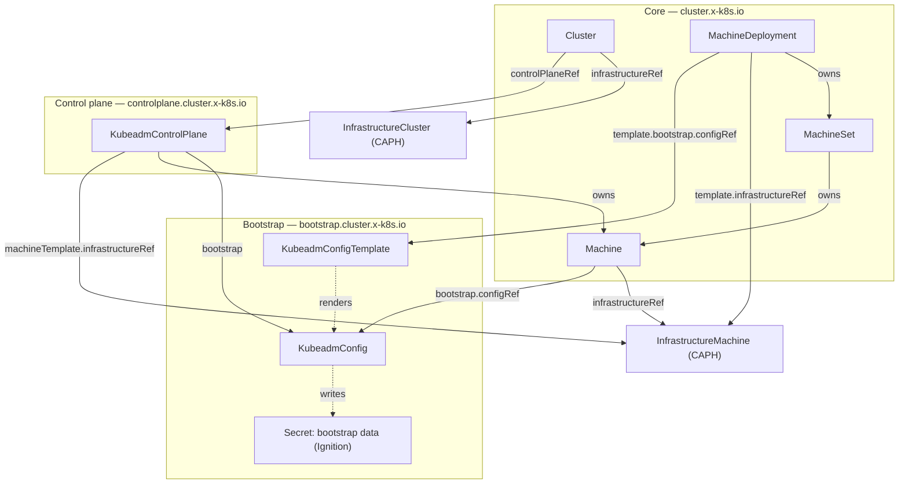
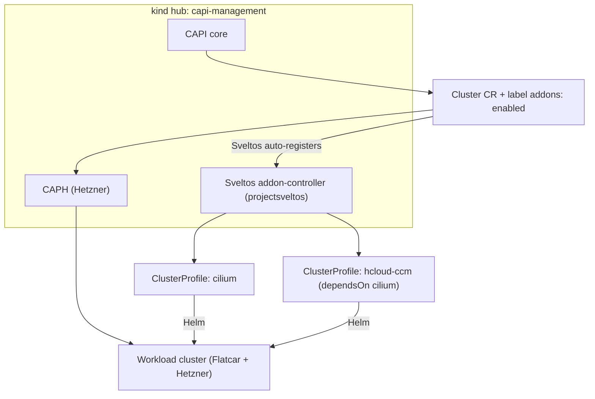

# Architecture

Two layers: **node provisioning** (CAPI + Flatcar sysext) and **addon
delivery** (Sveltos). The hub is the `kind` cluster `capi-management`.

## CAPI resource graph

`Machine` is the hinge: it binds one bootstrap config to one infrastructure
machine.

Namespaces: `capi-system` (core), `capi-kubeadm-control-plane-system` (KCP),
`capi-kubeadm-bootstrap-system` (CABPK), `caph-system` (Hetzner).

## Addon delivery (Sveltos)

Sveltos runs in the hub and **auto-discovers CAPI clusters** — it creates a
`SveltosCluster` and reads the workload kubeconfig from the CAPI-managed
secret. It then matches `ClusterProfile.clusterSelector` against the CAPI
`Cluster` labels and pushes addons from the hub (push model, so it works
before the workload has a CNI).

See `docs/addons.md` for the ClusterProfiles and `docs/bootstrap.md` for the
imperative bootstrap steps.
