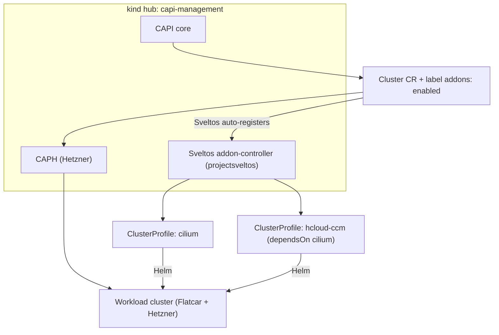

# Sveltos-based addon delivery for the Flatcar/Hetzner CAPI PoC

- **Date:** 2026-10-04
- **Status:** Approved (design), implementation in progress
- **Scope:** Manual Flatcar/Hetzner CAPI PoC (`manual-flatcar/`)

## Goal

Deliver in-cluster addons — the **CNI (Cilium)** and the **cloud controller
manager (hcloud CCM)** — to workload clusters **declaratively from the
management ("hub") cluster**, using [Sveltos](https://projectsveltos.io/),
instead of manually running `helm install` against the workload cluster.

The OS/Kubernetes delivery (vanilla Flatcar snapshot + upstream
`kubernetes.raw` sysext via Ignition) is **unchanged**.

## Non-goals

- No Argo CD / GitOps controller. Sveltos is the addon engine. (If GitOps is
  wanted later, Sveltos integrates with **Flux** sources, not Argo.)
- No in-place Kubernetes version upgrade automation (CAPI rollout stays the
  upgrade mechanism; `systemd-sysupdate.timer` stays disabled).
- No production secret management (SOPS/ESO). The PoC uses a single
  management-cluster secret.

## Context

- Hub = the `kind` cluster `capi-management`, running CAPI v1.14.2, CAPH
  v1.1.8, cert-manager.
- Workload = 1 control plane + 1 worker (`cpx22`, vanilla Flatcar + sysext).
- Today Cilium and hcloud-CCM are installed with `kubectl`/`helm` directly
  against the workload cluster (scripts `07`/`08`). This is imperative and not
  reproducible per-cluster.

## Architecture

Sveltos runs in the hub (`projectsveltos` namespace) and:

1. **Auto-discovers** CAPI clusters — it creates a `SveltosCluster` and reads
   the workload kubeconfig from the CAPI-managed secret. No separate
   registration controller is needed.
2. Matches `ClusterProfile.clusterSelector` against the **CAPI `Cluster`
   labels**.
3. Deploys Helm charts / manifests into matching workload clusters from the hub
   (push model), so it works even while the workload has no CNI yet.



### Components

| Component | Where | Purpose |
|---|---|---|
| Sveltos addon-controller | hub, `projectsveltos` | Reconcile addons onto managed clusters |
| Label `addons: enabled` | CAPI `Cluster` | Opts a cluster into the profiles |
| `ClusterProfile/cilium` | hub | Helm `cilium/cilium` 1.18.4 |
| `ClusterProfile/hcloud-ccm` | hub | Helm `hcloud/hcloud-cloud-controller-manager`, `dependsOn: [cilium]` |
| `hcloud-credentials` secret | hub | Distributed to workload for the CCM |

### Install mode

Sveltos **Mode 2 (centralised agent)**: agents live in the hub and monitor the
workload API; no Sveltos footprint in the workload. This also avoids the
"agent pod cannot schedule before Cilium exists" problem.

## Interfaces

Workload `Cluster` gets a label:

```yaml
metadata:
  name: hetzner-cluster
  labels:
    addons: enabled
```

Control plane / CNI profile:

```yaml
apiVersion: config.projectsveltos.io/v1beta1
kind: ClusterProfile
metadata:
  name: cilium
spec:
  clusterSelector:
    matchLabels:
      addons: enabled
  syncMode: Continuous
  helmCharts:
  - repositoryURL: https://helm.cilium.io/
    repositoryName: cilium
    chartName: cilium/cilium
    chartVersion: 1.18.4
    releaseName: cilium
    releaseNamespace: kube-system
    helmChartAction: Install
    values: |
      ipam:
        mode: kubernetes
      kubeProxyReplacement: false
```

CCM profile (ordered after Cilium):

```yaml
apiVersion: config.projectsveltos.io/v1beta1
kind: ClusterProfile
metadata:
  name: hcloud-ccm
spec:
  clusterSelector:
    matchLabels:
      addons: enabled
  dependsOn:
  - cilium
  syncMode: Continuous
  helmCharts:
  - repositoryURL: https://charts.hetzner.cloud
    repositoryName: hcloud
    chartName: hcloud-cloud-controller-manager
    chartVersion: <pinned>
    releaseName: hccm
    releaseNamespace: kube-system
    helmChartAction: Install
    values: |
      secretName: hcloud-credentials
      secretKeyName: hcloud-token
      cloudConfigName: hcloud-ccm-config
```

## Credentials

- The hcloud token is stored **once** in a hub Secret, created from `.env`
  (documented imperative step).
- A `ClusterProfile` `policyRefs` entry distributes the `hcloud-credentials`
  secret (and the `hcloud-ccm-config` ConfigMap) to the workload. The token
  never enters git.
- Cleaner future option: Sveltos `templateResourceRefs` to template the token
  from a single hub source, or External Secrets Operator.

## Ordering & failure behaviour

- `dependsOn` enforces Cilium → CCM per cluster.
- `syncMode: Continuous` reconciles changes; `ContinuousWithDriftDetection` can
  be enabled later (requires the agent, which is in the hub in Mode 2).
- Default `stopMatchingBehavior` withdraws addons if a cluster stops matching.

## Imperative bootstrap (documented, cannot be GitOps'd)

1. `kind create cluster` (hub).
2. `clusterctl init --infrastructure hetzner`.
3. Build/reuse the vanilla Flatcar snapshot (Packer).
4. `helm install projectsveltos ...`.
5. Create the hub `hcloud-credentials` secret from `.env`.
6. `kubectl apply` the CAPI manifests (Cluster + ClusterProfiles).

Everything on the workload (Cilium, CCM) is Sveltos-driven — no manual
`helm install` into the workload.

## Documentation deliverables

- `docs/architecture.md` — CAPI + Sveltos flows.
- `docs/bootstrap.md` — the imperative steps above, with rationale.
- `docs/addons.md` — ClusterProfiles, labels, ordering, credentials.
- README / IMPLEMENTATION-PLAN updates.

## Validation / acceptance criteria

- Teardown of the previous Hetzner cluster leaves no servers/LB/network.
- After rebuild: `ClusterProfile`s report `Provisioned` for the workload.
- Cilium and hcloud-CCM pods running in the workload `kube-system`.
- Nodes `Ready` with `providerID` set, without any manual `helm install` into
  the workload.
- All steps reproducible from the docs.

## Risks

- Sveltos⇄CAPI auto-registration requires correct RBAC (provided by the
  install manifests) and access to the CAPI kubeconfig secret.
- Mode 2 is less commonly deployed than Mode 1; validate carefully.
- Secret distribution semantics via `policyRefs` (referenced Secret must carry
  the manifest payload) need verification during implementation.
- CNI-less bootstrap: deployment works via the push model, but drift detection
  depends on the hub-side agent.
